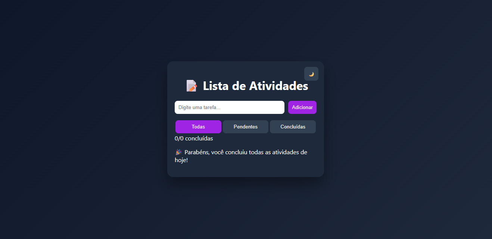

# Smart Task List

Aplicação de gerenciamento de tarefas desenvolvida com foco em lógica de programação e experiência do usuário.

## Funcionalidades
- Adicionar tarefas
- Remover tarefas
- Marcar como concluída
- Filtros de tarefas
- Contador de tarefas
- Tema dark/light
- Persistência com localStorage

## Tecnologias
- HTML
- CSS
- JavaScript

## Preview

## Deploy
https://alinedantass.github.io/smart-task-list/

## Objetivo
Projeto desenvolvido por Aline Dantas, para praticar manipulação de DOM, gerenciamento de estado e construção de interfaces interativas.
